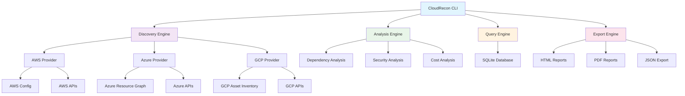

# CloudRecon

[](https://github.com/catherinevee/cloudrecon/actions)
[](https://github.com/catherinevee/cloudrecon/actions)
[](https://golang.org/)
[](LICENSE)
[]()

> Discover, analyze, and optimize your multi-cloud infrastructure across AWS, Azure, and GCP with zero infrastructure requirements.

## Why CloudRecon?

Managing multi-cloud infrastructure is complex. Teams struggle with:

- **Fragmented visibility** across AWS, Azure, and GCP
- **Manual discovery** of resources and dependencies
- **Security blind spots** from misconfigurations
- **Cost overruns** from unused or oversized resources
- **Compliance gaps** from inconsistent monitoring

CloudRecon solves these problems by providing instant, comprehensive visibility into your entire cloud estate through a single command-line tool.

## Architecture



## Quick Start

### Prerequisites

- Go 1.21+ (for building from source)
- Cloud credentials configured for at least one provider:
  - AWS: `aws configure` or environment variables
  - Azure: `az login` or service principal
  - GCP: `gcloud auth application-default login`
- 2 minutes

### Installation & First Run

```bash
# 1. Download and install
curl -L https://github.com/catherinevee/cloudrecon/releases/latest/download/cloudrecon-linux-amd64 -o cloudrecon
chmod +x cloudrecon

# 2. Discover your cloud resources
./cloudrecon discover

# 3. Run comprehensive analysis
./cloudrecon analyze
```

**Expected Output:**
```
Discovering cloud resources...
✓ AWS: 45 resources found
✓ Azure: 23 resources found  
✓ GCP: 12 resources found
Total: 80 resources discovered

Running analysis...
✓ Dependency mapping: 15 relationships identified
✓ Security scan: 3 issues found
✓ Cost analysis: $2,847/month estimated
Analysis complete in 2.3s
```

## Features

### Available Now

- **Multi-Cloud Discovery** - Unified view across AWS, Azure, and GCP
- **Zero Infrastructure** - Single binary, no databases or agents required
- **Offline-First** - Local SQLite caching for instant queries
- **Interactive CLI** - Guided workflows with intuitive terminal interface
- **Comprehensive Analysis** - Dependencies, security, and cost analysis
- **Rich Export** - HTML, PDF, and JSON report generation
- **Performance Optimized** - Parallel processing and intelligent caching
- **SQL Queries** - Query your infrastructure like a database

### In Development

- **Real-time Monitoring** - Continuous resource tracking
- **Policy Enforcement** - Automated compliance checking
- **Cost Optimization** - Automated resource right-sizing
- **Integration APIs** - REST API for external tooling

### Planned

- **Kubernetes Discovery** - Container orchestration analysis
- **Terraform Integration** - Infrastructure as Code validation
- **Slack/Teams Integration** - Automated reporting and alerts
- **Custom Rules Engine** - User-defined analysis rules

## Usage Examples

### Basic Discovery

```bash
# Discover all resources across all configured providers
./cloudrecon discover

# Discover specific provider
./cloudrecon discover --provider aws

# Discover with custom output directory
./cloudrecon discover --output ./my-discovery
```

### Analysis Commands

```bash
# Run comprehensive analysis
./cloudrecon analyze

# Run specific analysis types
./cloudrecon analyze --type security
./cloudrecon analyze --type cost
./cloudrecon analyze --type dependencies

# Interactive analysis mode
./cloudrecon interactive
```

### Query Your Infrastructure

```bash
# Find all EC2 instances
./cloudrecon query "SELECT * FROM resources WHERE type='ec2'"

# Find resources by cost
./cloudrecon query "SELECT * FROM resources WHERE monthly_cost > 100"

# Find security issues
./cloudrecon query "SELECT * FROM resources WHERE security_issues > 0"
```

### Export Results

```bash
# Export to HTML report
./cloudrecon export --format html --output report.html

# Export to PDF
./cloudrecon export --format pdf --output analysis.pdf

# Export raw data
./cloudrecon export --format json --output data.json
```

## Installation

### Pre-built Binaries

```bash
# Windows
curl -L https://github.com/catherinevee/cloudrecon/releases/latest/download/cloudrecon-windows-amd64.exe -o cloudrecon.exe

# Linux
curl -L https://github.com/catherinevee/cloudrecon/releases/latest/download/cloudrecon-linux-amd64 -o cloudrecon
chmod +x cloudrecon

# macOS
curl -L https://github.com/catherinevee/cloudrecon/releases/latest/download/cloudrecon-darwin-amd64 -o cloudrecon
chmod +x cloudrecon
```

### Docker

```bash
# Pull the latest image
docker pull ghcr.io/catherinevee/cloudrecon:latest

# Run CloudRecon
docker run --rm \
  -v ~/.aws:/root/.aws \
  -v ~/.azure:/root/.azure \
  -v ~/.config/gcloud:/root/.config/gcloud \
  ghcr.io/catherinevee/cloudrecon:latest discover
```

### From Source

```bash
git clone https://github.com/catherinevee/cloudrecon.git
cd cloudrecon
go build -o cloudrecon ./cmd/cloudrecon
```

## Configuration

### Environment Variables

```bash
# AWS Configuration
export AWS_ACCESS_KEY_ID=your_access_key
export AWS_SECRET_ACCESS_KEY=your_secret_key
export AWS_DEFAULT_REGION=us-west-2

# Azure Configuration
export AZURE_CLIENT_ID=your_client_id
export AZURE_CLIENT_SECRET=your_client_secret
export AZURE_TENANT_ID=your_tenant_id

# GCP Configuration
export GOOGLE_APPLICATION_CREDENTIALS=/path/to/service-account.json
export GOOGLE_CLOUD_PROJECT=your-project-id
```

### Configuration File

Create `~/.cloudrecon/config.yaml`:

```yaml
providers:
  aws:
    regions: ["us-west-2", "us-east-1"]
    services: ["ec2", "s3", "rds", "lambda"]
  azure:
    subscriptions: ["subscription-id-1", "subscription-id-2"]
  gcp:
    projects: ["project-1", "project-2"]

analysis:
  security:
    enabled: true
    rules: ["public-access", "encryption", "iam"]
  cost:
    enabled: true
    currency: "USD"
  dependencies:
    enabled: true
    depth: 3

export:
  default_format: "html"
  output_dir: "./reports"
```

## Comparison with Alternatives

| Feature | CloudRecon | AWS Config | Azure Resource Graph | GCP Asset Inventory | CloudCustodian |
|---------|------------|------------|---------------------|-------------------|----------------|
| Multi-cloud | ✓ | ✗ | ✗ | ✗ | ✓ |
| Zero infrastructure | ✓ | ✗ | ✗ | ✗ | ✗ |
| Offline queries | ✓ | ✗ | ✗ | ✗ | ✗ |
| Cost analysis | ✓ | ✗ | ✗ | ✗ | ✓ |
| Interactive CLI | ✓ | ✗ | ✗ | ✗ | ✗ |
| Rich reports | ✓ | ✗ | ✗ | ✗ | ✗ |

## Troubleshooting

### Common Issues

**Issue: "No credentials found"**
```bash
# AWS
aws configure

# Azure  
az login

# GCP
gcloud auth application-default login
```

**Issue: "Permission denied"**
```bash
# Ensure your credentials have necessary permissions
# AWS: CloudFormation, EC2, S3, RDS, IAM, Lambda, ECS, ElastiCache, ELBv2, Route53, SNS, SQS
# Azure: Reader role on subscriptions
# GCP: Cloud Asset Viewer role
```

**Issue: "Database locked"**
```bash
# Remove existing database and retry
rm ~/.cloudrecon/cloudrecon.db
./cloudrecon discover
```

## Contributing

We welcome contributions in the following areas:

- **Cloud Provider Integrations** - New services and providers
- **Analysis Rules** - Security, cost, and compliance checks
- **Test Coverage** - Unit, integration, and end-to-end tests
- **Documentation** - Examples, guides, and API documentation
- **Performance** - Optimization and caching improvements

### Development Setup

```bash
# Clone the repository
git clone https://github.com/catherinevee/cloudrecon.git
cd cloudrecon

# Install dependencies
go mod download

# Run tests
go test ./...

# Build the binary
go build -o cloudrecon ./cmd/cloudrecon
```

### Pull Request Process

1. Fork the repository
2. Create a feature branch (`git checkout -b feature/amazing-feature`)
3. Commit your changes (`git commit -m 'Add amazing feature'`)
4. Push to the branch (`git push origin feature/amazing-feature`)
5. Open a Pull Request

See [CONTRIBUTING.md](CONTRIBUTING.md) for detailed guidelines.

## Security

### Reporting Vulnerabilities

If you discover a security vulnerability, please report it responsibly:

1. **Do not** open a public issue
2. Email security details to: security@cloudrecon.dev
3. Include steps to reproduce the vulnerability
4. We will respond within 48 hours

### Security Features

- **No credential storage** - Credentials are never persisted
- **Local processing** - All analysis happens locally
- **Read-only access** - CloudRecon never modifies your infrastructure
- **Secure defaults** - Minimal permissions required

## Documentation

- [User Guide](docs/user-guide.md) - Comprehensive usage documentation
- [API Reference](docs/api-reference.md) - Complete API documentation
- [Configuration Guide](docs/configuration.md) - Detailed configuration options
- [Troubleshooting](docs/troubleshooting.md) - Common issues and solutions
- [Contributing Guide](CONTRIBUTING.md) - Development and contribution guidelines

## Roadmap

### Q1 2024
- Real-time monitoring capabilities
- Enhanced security analysis rules
- Cost optimization recommendations

### Q2 2024
- Kubernetes discovery and analysis
- Terraform integration
- Custom rules engine

### Q3 2024
- Slack and Microsoft Teams integration
- REST API for external tooling
- Advanced reporting and dashboards

### Q4 2024
- Multi-tenant support
- Enterprise features
- Compliance frameworks (SOC2, HIPAA)

## Dependencies

- **Go 1.21+** - Core runtime
- **SQLite** - Local data storage
- **AWS SDK v2** - AWS service integration
- **Azure SDK** - Azure service integration
- **GCP SDK** - Google Cloud service integration
- **Cobra** - CLI framework
- **Viper** - Configuration management

## Support

- **Issues**: [GitHub Issues](https://github.com/catherinevee/cloudrecon/issues)
- **Discussions**: [GitHub Discussions](https://github.com/catherinevee/cloudrecon/discussions)
- **Security**: [Security Advisory](https://github.com/catherinevee/cloudrecon/security/advisories)
- **Email**: support@cloudrecon.dev

## License

MIT License - see [LICENSE](LICENSE) file for details.

## Acknowledgments

- AWS, Azure, and GCP teams for their comprehensive APIs
- The Go community for excellent libraries and tools
- Contributors and users who provide feedback and improvements

---

**CloudRecon** - Making multi-cloud infrastructure management simple and accessible.